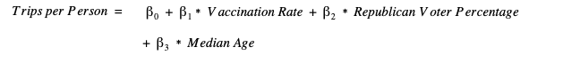
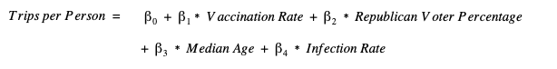

```{r setup, include=FALSE}
knitr::opts_chunk$set(echo = TRUE)
install.packages('regclass')
```

```{r libraries, include=FALSE}
library(tidyverse)
library(ggplot2) 
library(sandwich)
library(stargazer)
library(rjson)
library(jsonlite)
library(RCurl)
library(gridExtra)
library(regclass)
library(lmtest)

```

```{r import data, include=FALSE, message=FALSE, warning=FALSE}
vax <- read.csv('../src/data/vaccinations_raw_data/us_state_vaccinations.csv')
infect <- read.csv('../src/data/infections_raw_data/us-states.csv')
infect_ra <- read.csv('../src/data/infections_raw_data/us-states-rolling-average.csv')
age_data_raw <- read_csv("../src/data/age_raw_data/ACSDP1Y2019.DP05_data_with_overlays_2021-07-15T131842.csv")
trips_raw_may2021 <- read_csv("../src/data/trips_by_distance_may2021.csv")
elections_df <- read_csv("../src/data/elections_raw_data/1976-2020-president.csv")

```

```{r initial data transformation, echo=FALSE, message=FALSE, warning=FALSE}

##Clean up vaccination data
vax$location[vax$location == 'New York State'] <- 'New York'


##Produce median age
age_data <- age_data_raw %>%
  select(GEO_ID,
         STATE_NAME = NAME,
         DP05_0018E) %>%
  filter(STATE_NAME != "Geographic Area Name") %>%
  transform(MEDIAN_AGE = as.numeric(DP05_0018E)) %>%
  select(GEO_ID,
         state = STATE_NAME,
         MEDIAN_AGE)

##Produce trip variables
trips_aggregated_by_state <- trips_raw_may2021 %>%
  filter(Level=='State') %>%
  mutate (Total_Population = `Population Not Staying at Home` + `Population Staying at Home`,
          Trips_Over_25 = `Number of Trips` - `Number of Trips <1` - `Number of Trips 1-3` -
                          `Number of Trips 3-5` - `Number of Trips 5-10` - `Number of Trips 10-25`) %>%
  select (Level,
          Date,
          `State FIPS`,
          `State Postal Code`,
          `Population Staying at Home`,
          `Population Not Staying at Home`,
          Total_Population,
          `Number of Trips`,
          Trips_Over_25) %>%
  group_by (`State Postal Code`) %>%
  summarize(Total_Population_Staying_Home = mean(`Population Staying at Home`),
            Total_Population_Not_Staying_Home=mean(`Population Not Staying at Home`),
            Total_Population=mean(Total_Population),
            Total_Trips = sum(`Number of Trips`),
            Total_Trips_over_25=sum(Trips_Over_25)
            ) %>% 
  mutate(Trips_per_person = Total_Trips/Total_Population,
        Trips_over_25_per_person = Total_Trips_over_25/Total_Population
        ) %>% 
  subset(`State Postal Code` != 'DC') %>% 
  mutate(state = state.name[match(`State Postal Code`,state.abb)])


#Produce voting variables
vote_dist <- elections_df %>%
  select(state,
         party_simplified,
         candidatevotes,
         totalvotes,
         year) %>%
  filter(year == 2020) %>%
  mutate(rep_vote_percentage = case_when(party_simplified == "REPUBLICAN" ~ candidatevotes / totalvotes),
         dem_vote_percentage = case_when(party_simplified == "DEMOCRAT" ~ candidatevotes / totalvotes),
         dem_votes = case_when(party_simplified == "DEMOCRAT" ~ candidatevotes),
         rep_votes = case_when(party_simplified == "REPUBLICAN" ~ candidatevotes),
         state = str_to_title(state, locale = "en")
         ) %>%
  group_by(state) %>%
  summarise(
    rep_vote_percentage = max(rep_vote_percentage, na.rm = T),
    dem_vote_percentage = max(dem_vote_percentage, na.rm = T),
    dem_votes = max(dem_votes, na.rm = T),
    rep_votes = max(rep_votes, na.rm = T)
  ) %>% 
  mutate(rep_vote_percentage_overall = rep_votes / (rep_votes + dem_votes)) %>%
  select(state,
         rep_vote_percentage,
         dem_vote_percentage,
         rep_votes,
         dem_votes,
         rep_vote_percentage_overall
         )


#Produce vaccination and infection variables
vax_infect_data <-
  merge(infect, vax, by.x = c('date','state'), by.y = c('date','location')) %>% 
  filter(date == '2021-05-30') %>% 
  mutate(people = round(total_vaccinations / total_vaccinations_per_hundred * 100),
         cases_per_hundred = (cases / (people / 100000)),
         deaths_per_hundred = (deaths / (people / 100000)),
         vaccination_rate = ((((people_vaccinated - people_fully_vaccinated) * 0.5) + people_fully_vaccinated) / people),
         infection_rate = cases / people
         )

```

```{r create model dataset, echo=FALSE, message=FALSE, warning=FALSE}

model_data <- vax_infect_data %>%  
  inner_join(trips_aggregated_by_state, by = c('state')) %>% 
  inner_join(age_data, by = c('state')) %>%
  inner_join(vote_dist, by = c('state')) %>%
  mutate(trips_per_person = Total_Trips / people,
         trips_over_25_per_person = Total_Trips_over_25 / people
         ) %>%
  select(state,
         vaccination_rate,
         infection_rate,
         people,
         total_vaccinations,
         people_vaccinated,
         people_fully_vaccinated,
         total_vaccinations_per_hundred,
         people_vaccinated_per_hundred,
         people_fully_vaccinated_per_hundred,
         cases,
         deaths,
         cases_per_hundred,
         deaths_per_hundred,
         # cases_avg,
         # deaths_avg,
         # cases_avg_per_100k,
         # deaths_avg_per_100k,
         trips = Total_Trips,
         trips_over_25 = Total_Trips_over_25,
         trips_per_person,
         trips_over_25_per_person,
         median_age = MEDIAN_AGE,
         rep_vote_percentage,
         dem_vote_percentage,
         rep_votes,
         dem_votes,
         rep_vote_percentage_overall
         )


```

```{r convert percent variables to integers, echo=FALSE, message=FALSE, warning=FALSE}

model_data <- model_data %>%  
  mutate(vaccination_rate = vaccination_rate * 100,
         infection_rate = infection_rate * 100,
         rep_vote_percentage_overall = rep_vote_percentage_overall * 100
  )

```

# Introduction  

The pandemic has driven people back into their homes on a level never seen in modern history. However, vaccine distribution reached scale right around the one year anniversary of initial lockdowns, and the national morale and confidence about the situation seemingly improved by the day. Our research question asks how mobile are the people in each state as of the end of May 2021, and how much of that is driven by the vaccination rate in that state.

Our hypothesis is that mobility can be measured in a simple but elegant way. Using data from the COVID-19 Mobility Report (collected by Google), we hope to define mobility as trips per person. Review of Google’s documentation and our knowledge of Google’s tracking capabilities in general suggest that the data was collected in a consistent and unbiased manner. Our primary explanatory variable, vaccination rate, is also thoroughly tracked at the state and federal government level. We are reasonably confident that state’s are consistent in reporting their vaccination totals.  

We acknowledge that there are potentially several other factors that drive mobility in the COVID era. As the pandemic became more political, a state’s age and party leanings seemed to have an effect on the general attitude towards the gravity of the pandemic. How hard a state was hit through the duration of the pandemic (defined as the number of cases) may still be playing a role in people’s mindset and mobility even if cases are currently low and vaccination rate is high. We will assess the impact of other potential explanatory variables by conducting a series of regression models, rather than just one.  

# Model Building Process

## Measurement Goal  

We aim to measure the amount of mobility that people in the United States have during the COVID pandemic. Specifically, our variable of interest is the total number of trips per person in May 2021, and we are investigating how that measure differs across states. We have considered several definitions of what constitutes a trip, as the data we used stratified trips by distance (in miles). We eventually decided to consider all trips of any distance, to eliminate any unknown bias for size of the state, as this could potentially impact the typical length of trip a person takes.

We also collected data from several sources to assess the correlation between input variables and our outcome variable of interest. As will be described in more detail in the next section, this included state (or county) level data on COVID infections and deaths, vaccinations, resident age, and voting history.

## Modeling Goal and Causal Theory  

The goal of this modeling exercise is to determine the causal relationship of a state’s vaccination rate and the mobility of its residents. Our hypothesis is that vaccination rate is the primary determinant of how mobile people are recently, given the intense national focus on the current state of the pandemic. However, we appreciate that there are other factors that could prove to have a sizable impact in describing states’ mobility.  

In the same way that political preference, age, and cumulative cases may have an impact on mobility; we also expect they may have a confounding impact on the model because of correlation with vaccination rate. We expect median age almost certainly will, given the consistent emphasis on the fact that older people tend to be more adversely impacted by the virus. 

We will produce a series of models that include progressively more variables in an attempt to isolate causality, significance, and correlation.  

## Exploratory Analysis Findings
We set out to build a model that used some variable containing vaccination rate information to explain mobility on a state-by-state basis. Additionally, we were interested in variables related to infection prevalence, political leanings, and age. Our primary focus throughout our exploratory data analysis was to determine which variables we would use to represent this information, their structure, and any transformations we would need to apply to better explain the relationships.

### Data Collection
We compiled our data from a series of datasets (listed below) aggregating each variable on our unit of observation: state. We used the most recent available data up until, but not including, June 1, 2021. 

#### Datasets

* **[The American Community Survey](https://data.census.gov/cedsci/table?q=ACS&g=0100000US.04000.001&tid=ACSDP1Y2019.DP05&moe=false&hidePreview=true)**: A dataset from the US Census Bureau containing state-level demographics and other indicators of general interest from the 2019 census, which we used to gather the median age for each state. 
* **[CDC Data on Vaccinations](https://data.cdc.gov/Vaccinations/COVID-19-Vaccinations-in-the-United-States-County/8xkx-amqh)**: A dataset from the US Centers for Disease Control containing county-level information about vaccination rates, which we used to calculate vaccination rates for each state. 
* **[Bureau of Transportation Statistics](https://data.bts.gov/Research-and-Statistics/Trips-by-Distance/w96p-f2qv)**: A dataset with the number of trips of a given distance taken by residents of a specified geography, which we used to gather the avg. number of trips per person by state.
* **[New York Times Covid-19 Data](https://github.com/nytimes/covid-19-data)**: A database, compiled from several authoritative sources on the occurrence of COVID-19 at the county level, which we used to calculate infection rates by state
* **[2020 General Election Results Data](https://dataverse.harvard.edu/file.xhtml?fileId=4299753&version=6.0)**: A dataset with the number of votes towards a given presidential candidate broken out by state and election year, which we used to calculate the percentage of votes for the Republican Party in the 2020 Presidential Election. 

\newpage

### Variable Distributions & Operationalization

#### Avg. Trips Per Person (Outcome Variable)
We examined 4 potential variables for mobility: total trips, avg. trips per person, total trips over 25 miles, and avg. total trips over 25 miles per person. Total trips and total trips over 25 miles both had skewed distributions while avg. trips per person and avg. trips over 25 miles per person followed approximately normal distributions. We chose to include all trips and not just those over 25 miles, because each state has a unique geography and infrastructure. For example, a population-dense, urban city like New York City may have many more trips that are less than 25 miles causing the state of New York’s results to look dramatically different from a state such as Wyoming that is largely spread out. 

```{r trips plots, echo=FALSE, message=FALSE, warning=FALSE}

# Total trips
total_trips_plot <- model_data %>%
  ggplot() +
  theme_classic() +
  theme(plot.title = element_text(hjust = 0.5)) +
  aes(x=trips) + 
  geom_histogram(bins=20) +
  labs(title = "Total Trips Distribution",
      x = "Total Trips",
      y= "Number of States")

# Trips per person
trip_per_person_plot <- model_data %>%
  ggplot() +
  theme_classic() +
  theme(plot.title = element_text(hjust = 0.5)) +
  aes(x=trips_per_person) + 
  geom_histogram(bins=20) +
  labs(title = "Trips per Person",
      x = "Trips per person",
      y= "Number of States")


# Total trips above 25 miles
total_trips_25_plot <- model_data %>%
  ggplot() +
  theme_classic() +
  theme(plot.title = element_text(hjust = 0.5)) +
  aes(x=trips_over_25) + 
  geom_histogram(bins = 20) +
  labs(title = "Total Trips over 25 miles",
      x = "Total Trips over 25 miles",
      y= "Number of States")


# Total trips above 25 miles per person
trips_25_per_person_plot <- model_data %>%
  ggplot() +
  theme_classic() +
  theme(plot.title = element_text(hjust = 0.5)) +
  aes(x=trips_over_25_per_person) + 
  geom_histogram(bins=20) +
  labs(title = "Trips over 25 miles per Person",
      x = "Trips over 25 miles per person",
      y = "Number of States")

grid.arrange(total_trips_plot, trip_per_person_plot, 
             total_trips_25_plot, trips_25_per_person_plot, ncol = 2, nrow = 2)
```

\newpage

#### Vaccination Rates (Primary Causal Variable of Interest)
We examined two potential variables for vaccinations: total vaccinations per 100k residents and vaccination rate. Total vaccinations treated all vaccinations (those fully vaccinated and those partially) as equal and considered how prevalent vaccinations were for every 100k residents in a state. Because this distribution appeared to be bimodal and it treated all vaccines as equal, we opted to use vaccination rate. 

Vaccination rate was calculated as follows:

\[
\text{Vaccination Rate} = 100 * \frac{\text{People Fully Vaccinated} + (\text{People Vaccinated - People Fully Vaccinated } * 0.5)}{\text{People}}
\]

We weighted those who weren’t fully vaccinated as half of vaccination; because while these people still required a shot, evidence suggests they are more immune to the virus compared to those without the booster. 

Vaccination rate also appeared bimodal, but we believed differentiating between those partially and fully vaccinated, as well as, dividing by the entire population provided a much more accurate view of vaccine prevalence.

```{r vaccination plots, echo=FALSE, message=FALSE, warning=FALSE}

vax_rate_plot <- model_data %>%
  ggplot() +
  theme_classic() +
  theme(plot.title = element_text(hjust = 0.5)) +
  aes(x=vaccination_rate) +
  geom_histogram(bins=25, fill = "Black") +
  labs(
    title='Vaccination Rate',
    x='Vaccination Rate (%)',
    y='Number of States'
  )

vax_per_100k_plot <- model_data %>%
  ggplot() +
  theme_classic() +
  theme(plot.title = element_text(hjust = 0.5)) +
  aes(x=total_vaccinations_per_hundred) +  
  geom_histogram(bins=25, fill = "Black") +
  labs(
    title='Vaccinations Per 100k Residents',
    x='Vaccinations per 100k Residents',
    y='Number of States'
  )

grid.arrange(vax_rate_plot, vax_per_100k_plot, ncol = 2)

```

\newpage

#### Infection Rate
We examined three potential variables for infection prevalence: cases per 100k residents, all time infection rate, infection rate with 7-day rolling avg. Cases per 100k residents had a large skew in its distribution, which we believed would dramatically skew our results. 

Generally, the 7 day rolling average number of cases as of the end May in each state were as low as the average had been throughout the entire pandemic. This caused significant skew in the distribution of the average, and downstream caused model results to be difficult to interpret. Because of this, we reverted to using the all time infection rate, defined as total cases / total residents. This variable still represented the current snapshot scenario for each state, but created a more normal distribution while also aligning with our initial understanding of which states experienced the highest infection rates.

\[
\text{Infection Rate} = 100 * \frac{\text{Cumulative Cases}}{\text{People}}
\]


```{r infection plots, echo=FALSE, message=FALSE, warning=FALSE}

infect_rate_plot <- model_data %>%
  ggplot() +
  theme_classic() +
  theme(plot.title = element_text(hjust = 0.5)) +
  aes(x=infection_rate) +
  geom_histogram(bins=25, fill = "Dark Green") +
  labs(
    title='Infection Rate',
    x='Infection Rate (%)',
    y='Number of States'
  )

case_per_100k_plot <- model_data %>%
  ggplot() +
  theme_classic() +
  theme(plot.title = element_text(hjust = 0.5)) +
  aes(x=cases_per_hundred) +
  geom_histogram(bins=25, fill = "Dark Green") +
  labs(
    title='Cases Per 100k Residents',
    x='Cases per 100k Residents',
    y='Number of States'
  )

grid.arrange(infect_rate_plot, case_per_100k_plot, ncol = 2)

```

\newpage

#### Median Age  

We only examined one potential variable for age, because of our dataset limitations: median age. Media age had an approximately normal distribution with unconcerning outliers. 

#### Rep. Voting Percentage
We examined two potential situations for political leaning based on our dataset: statewide results for the 2020 presidential election. In the first scenario, we would use two variables: the percentage of the state who voted for the republican candidate and the percentage of the state who voted for the democratic candidate. Using both variables would allow us to include information about third party voting percentages (100 - the sum of Republican and Democratic voting percentages.) We ultimately decided against this situation, because the variables were nearly perfectly correlated and we would use up degrees of freedom by adding another variable while gaining very little information. 

Instead we chose the second scenario, which only considered republican and democratic votes. In this scenario, we used one variable: the percentage of republican votes out of the two major parties. This variable contained information about both major parties and minimized the number of variables we were using. The distribution of this variable was approximately normal with 10 bins, but appeared trimodal with 20. There was one major outlier (DC), which didn’t concern us, because we wouldn’t be including DC in our date, because many of our other variables didn’t contain information for DC.  


```{r age and voting plots, echo=FALSE, message=FALSE, warning=FALSE}

median_age_hist <- model_data %>%
  ggplot() +
  theme_classic() +
  theme(plot.title = element_text(hjust = 0.5)) +
  aes(x=median_age) +
  geom_histogram(bins=20, fill = "Orange") +
  labs(
    title='Median Age Distribution Across US States',
    x='Median Age in US States',
    y='Number of States'
  )

dist_rep_hist2 <- model_data %>%
  ggplot() +
  theme_classic() +
  theme(plot.title = element_text(hjust = 0.5)) +
  aes(x = rep_vote_percentage_overall) + 
  geom_histogram(bins = 20, fill = "Red") + 
  labs(x = "Rep Votes as % of Dems & Reps", y = "Frequency", title = "Rep Voting Distribution", subtitle = "Scenario 2")


dist_dem_hist1 <- model_data %>%
  ggplot() +
  theme_classic() +
  theme(plot.title = element_text(hjust = 0.5)) +
  aes(x = dem_vote_percentage) + 
  geom_histogram(bins = 20, fill = "Blue") + 
  labs(x = "Dem Vote %", y = "Number of States", title = "Dem Voting Distribution", subtitle = "Scenario 1")


dist_rep_hist1 <- model_data %>%
  ggplot() +
  theme_classic() +
  theme(plot.title = element_text(hjust = 0.5)) +
  aes(x = rep_vote_percentage) + 
  geom_histogram(bins = 20, fill = "Red") + 
  labs(x = "Rep Vote %", y = "Number of States", title = "Rep Voting Distribution", subtitle = "Scenario 1")


grid.arrange(median_age_hist, dist_rep_hist2, dist_dem_hist1, dist_rep_hist1, ncol = 2, nrow = 2)
```

\newpage

### Variable Relationships & Transformations
In the second phase of our exploratory analysis, we examined the relationships our variables had with each other—most importantly, the relationship with our outcome variable. From the scatterplots we created, we discovered that the variable republican voting percentage had moderate to strong linear relationships with all of our variables except median age. Because of this relationship, we prioritized republican voting percentage in our model specifications hoping it would help reduce noise in our model. 

Based on the findings from this section of our exploratory analysis, we elected to not transform any variables. The variables in their current form don’t have any dramatic skew that needs to be corrected. Nor do they appear to gain any explanatory  information about our outcome variable through transformation. 

``` {r scatterplots for report, echo=FALSE, message=FALSE, warning=FALSE}
ma_tpp_plot <- model_data %>%
  ggplot() + 
  theme_classic() +
  theme(plot.title = element_text(hjust = 0.5)) +
  aes(x = median_age, y = trips_per_person) +
  geom_point() +
  stat_smooth() +
  labs (title='Median Age & Trips Per Person',
        x = 'Median Age',
        y = 'Trips Per Person') 

ir_tpp_plot <- model_data %>%
  ggplot() + 
  theme_classic() +
  theme(plot.title = element_text(hjust = 0.5)) +
  aes(x = infection_rate, y = trips_per_person) +
  geom_point() +
  stat_smooth() +
  labs (title='Infection Rate & Trips Per Person',
        x = 'Infection Rate',
        y = 'Trips per person') 

rvp_tpp_plot <- model_data %>%
  ggplot() +
  theme_classic() +
  theme(plot.title = element_text(hjust = 0.5)) +
  aes(x = rep_vote_percentage_overall, y = trips_per_person) +
  geom_point() +
  geom_smooth() +
  labs (title='Rep Voting % & Trips Per Person',
        x = 'Rep Vote %', y = "Trips Per Person") 

vr_tpp_plot <- model_data %>%
  ggplot() + 
  theme_classic() +
  theme(plot.title = element_text(hjust = 0.5)) +
  aes(x = vaccination_rate, y = trips_per_person) +
  geom_point() +
  geom_smooth() +
  labs (title='Vaccination Rates & Trips Per Person',
        x = "Vaccination Rates", y = 'Trips Per Person')

grid.arrange(vr_tpp_plot, rvp_tpp_plot, ma_tpp_plot, ir_tpp_plot, ncol = 2, nrow = 2)

```

``` {r median age vs trips relationship EDA, include=FALSE, echo=FALSE, message=FALSE, warning=FALSE}
model_data %>%
  ggplot() + 
  theme_classic() +
  theme(plot.title = element_text(hjust = 0.5)) +
  aes(x = median_age, y = trips_per_person) +
  geom_point() +
  stat_smooth() +
  labs (title='Relationship between median age and trips per person in May 2021 in US States',
        x = 'Median Age in a State',
        y = 'Trips per person in US states in May 2021') 

model_data %>%
  ggplot() + 
  theme_classic() +
  theme(plot.title = element_text(hjust = 0.5)) +
  aes(x = median_age, y = trips)+
  geom_point() +
  stat_smooth() +
  labs (title='Relationship between median age and total trips in May 2021 in US States',
        x = 'Median Age in a State',
        y = 'Total Trips in US states in May 2021') 

```

```{r vaccination & infection plots, include=FALSE, echo=FALSE, message=FALSE, warning=FALSE}
model_data %>%
  ggplot() +
  theme_classic() +
  theme(plot.title = element_text(hjust = 0.5)) +
  aes(x=vaccination_rate, y=infection_rate) +
  geom_point() +
  labs(
    title='Scatterplot of COVID-19 Vaccination vs. Infection Rates by State',
    x='Vaccination Rate',
    y='Infection Rate'
  )

```


```{r median age vs infections relationship EDA, include=FALSE, echo=FALSE, message=FALSE, warning=FALSE}
model_data %>%
  ggplot() + 
  theme_classic() +
  theme(plot.title = element_text(hjust = 0.5)) +
  aes(x = median_age, y = infection_rate) +
  geom_point() +
  stat_smooth() +
  labs (title='Relationship between median age and infection rate',
        x = 'Median Age in a State',
        y = 'Infection Rate') 

model_data %>%
  ggplot() + 
  theme_classic() +
  theme(plot.title = element_text(hjust = 0.5)) +
  aes(x = median_age, y = cases_per_hundred) +
  geom_point() +
  stat_smooth() +
  labs (title='Relationship between median age and cases per 100K residents',
        x = 'Median Age in a State',
        y = 'Cases per 100K residents') 

```

```{r median age vs vaccinations relationship EDA, include=FALSE, echo=FALSE, message=FALSE, warning=FALSE}
model_data %>%
  ggplot() + 
  theme_classic() +
  theme(plot.title = element_text(hjust = 0.5)) +
  aes(x = median_age, y = vaccination_rate) +
  geom_point() +
  stat_smooth() +
  labs (title='Relationship between median age and vaccination rate',
        x = 'Median Age in a State',
        y = 'Vaccination Rate') 

model_data %>%
  ggplot() + 
  theme_classic() +
  theme(plot.title = element_text(hjust = 0.5)) +
  aes(x = median_age, y = total_vaccinations_per_hundred) +
  geom_point() +
  stat_smooth() +
  labs (title='Relationship between median age and vaccinations per 100K residents',
        x = 'Median Age in a State',
        y = 'Vaccinations per 100K residents') 


```

```{r infections vs trips relationship EDA, include=FALSE, echo=FALSE, message=FALSE, warning=FALSE}
model_data %>%
  ggplot() + 
  theme_classic() +
  theme(plot.title = element_text(hjust = 0.5)) +
  aes(x = infection_rate, y = trips_per_person) +
  geom_point() +
  stat_smooth() +
  labs (title='Relationship between infection rate and trips per person',
        x = 'Infection Rate',
        y = 'Trips per person') 

model_data %>%
  ggplot() + 
  theme_classic() +
  theme(plot.title = element_text(hjust = 0.5)) +
  aes(x = cases_per_hundred, y = trips_per_person) +
  geom_point() +
  stat_smooth() +
  labs (title='Relationship between cases per 100K residents and trips per person',
        x = 'Cases per 100K residents',
        y = 'Trips per person') 

model_data %>%
  ggplot() + 
  theme_classic() +
  theme(plot.title = element_text(hjust = 0.5)) +
  aes(x = infection_rate, y = trips) +
  geom_point() +
  stat_smooth() +
  labs (title='Relationship between infection rate and total trips',
        x = 'Infection Rate',
        y = 'Total Trips') 

model_data %>%
  ggplot() + 
  theme_classic() +
  theme(plot.title = element_text(hjust = 0.5)) +
  aes(x = cases_per_hundred, y = trips) +
  geom_point() +
  stat_smooth() +
  labs (title='Relationship between cases per 100K residents and total trips',
        x = 'Cases per 100K residents',
        y = 'Total Trips') 

```


```{r rep voting & infection rates, include=FALSE, echo=FALSE, message=FALSE, warning=FALSE}
model_data %>%
  ggplot() + 
  theme_classic() +
  theme(plot.title = element_text(hjust = 0.5)) +
  aes(x = infection_rate, y = rep_vote_percentage_overall) +
  geom_point() +
  geom_smooth() +
  labs (title='Relationship between infection rate and 2020 Presidential Party Votes',
        x = "Infection Rates", y = 'Rep Vote %') 

model_data %>%
  ggplot() + 
  theme_classic() +
  theme(plot.title = element_text(hjust = 0.5)) +
  aes(x = log(infection_rate), y = rep_vote_percentage_overall) +
  geom_point() +
  geom_smooth() +
  labs (title='Relationship between infection rate and 2020 Presidential Party Votes',
        x = "Log Infection Rates", y = 'Rep Vote %') 

model_data %>%
  ggplot() + 
  theme_classic() +
  theme(plot.title = element_text(hjust = 0.5)) +
  aes(x = infection_rate, y = log(rep_vote_percentage_overall)) +
  geom_point() +
  geom_smooth() +
  labs (title='Relationship between infection rate and 2020 Presidential Party Votes',
        x = "Infection Rates", y = 'Log Rep Vote %')

model_data %>%
  ggplot() + 
  theme_classic() +
  theme(plot.title = element_text(hjust = 0.5)) +
  aes(x = log(infection_rate), y = log(rep_vote_percentage_overall)) +
  geom_point() +
  geom_smooth() +
  labs (title='Relationship between infection rate and 2020 Presidential Party Votes',
        x = "Log Infection Rates", y = 'Log Rep Vote %')

model_data %>%
  ggplot() + 
  theme_classic() +
  theme(plot.title = element_text(hjust = 0.5)) +
  aes(x = cases_per_hundred, y = rep_vote_percentage_overall) +
  geom_point() +
  geom_smooth() +
  labs (title='Relationship between cases and 2020 Presidential Party Votes',
        x = "Cases per 100", y = 'Rep Vote %')
```

```{r rep voting & vaccination rates, include=FALSE, echo=FALSE, message=FALSE, warning=FALSE}

model_data %>%
  ggplot() + 
  theme_classic() +
  theme(plot.title = element_text(hjust = 0.5)) +
  aes(x = vaccination_rate, y = rep_vote_percentage_overall) +
  geom_point() +
  geom_smooth() +
  labs (title='Relationship between Vaccination Rates and 2020 Presidential Party Votes',
        x = "Vaccination Rates", y = 'Rep Vote %') 

model_data %>%
  ggplot() + 
  theme_classic() +
  theme(plot.title = element_text(hjust = 0.5)) +
  aes(x = log(vaccination_rate), y = rep_vote_percentage_overall) +
  geom_point() +
  geom_smooth() +
  labs (title='Relationship between Vaccination Rates and 2020 Presidential Party Votes',
        x = "Log Vaccination Rates", y = 'Rep Vote %') 

model_data %>%
  ggplot() + 
  theme_classic() +
  theme(plot.title = element_text(hjust = 0.5)) +
  aes(x = vaccination_rate, y = log(rep_vote_percentage_overall)) +
  geom_point() +
  geom_smooth() +
  labs (title='Relationship between Vaccination Rates and 2020 Presidential Party Votes',
        x = "Vaccination Rates", y = 'Log Rep Vote %')

model_data %>%
  ggplot() + 
  theme_classic() +
  theme(plot.title = element_text(hjust = 0.5)) +
  aes(x = log(vaccination_rate), y = log(rep_vote_percentage_overall)) +
  geom_point() +
  geom_smooth() +
  labs (title='Relationship between Vaccination Rates and 2020 Presidential Party Votes',
        x = "Log Vaccination Rates", y = 'Log Rep Vote %')

```

```{r rep voting & trips per person, include=FALSE, echo=FALSE, message=FALSE, warning=FALSE}

model_data %>%
  ggplot() +
  theme_classic() +
  theme(plot.title = element_text(hjust = 0.5)) +
  aes(x = trips_per_person, y = rep_vote_percentage_overall) +
  geom_point() +
  geom_smooth() +
  labs (title='Relationship between Trips Per Person and 2020 Presidential Party Votes',
        x = "Trips Per Person", y = 'Rep Vote %') 

model_data %>%
  ggplot() + 
  theme_classic() +
  theme(plot.title = element_text(hjust = 0.5)) +
  aes(x = log(trips_per_person), y = rep_vote_percentage_overall) +
  geom_point() +
  geom_smooth() +
  labs (title='Relationship between Trips Per Person and 2020 Presidential Party Votes',
        x = "Log Trips Per Person", y = 'Rep Vote %') 

model_data %>%
  ggplot() + 
  theme_classic() +
  theme(plot.title = element_text(hjust = 0.5)) +
  aes(x = trips_per_person, y = log(rep_vote_percentage_overall)) +
  geom_point() +
  geom_smooth() +
  labs (title='Relationship between Trips Per Person and 2020 Presidential Party Votes',
        x = "Trips Per Person", y = 'Log Rep Vote %')

model_data %>%
  ggplot() + 
  theme_classic() +
  theme(plot.title = element_text(hjust = 0.5)) +
  aes(x = log(trips_per_person), y = log(rep_vote_percentage_overall)) +
  geom_point() +
  geom_smooth() +
  labs (title='Relationship between Trips Per Person and 2020 Presidential Party Votes',
        x = "Log Trips Per Person", y = 'Log Rep Vote %')

```

```{r trips per person & vaccination rates, include=FALSE, echo=FALSE, message=FALSE, warning=FALSE}

model_data %>%
  ggplot() + 
  theme_classic() +
  theme(plot.title = element_text(hjust = 0.5)) +
  aes(x = vaccination_rate, y = trips_per_person) +
  geom_point() +
  geom_smooth() +
  labs (title='Relationship between Vaccination Rates and Trips Per Person',
        x = "Vaccination Rates", y = 'Trips Per Person') 

model_data %>%
  ggplot() + 
  theme_classic() +
  theme(plot.title = element_text(hjust = 0.5)) +
  aes(x = log(vaccination_rate), y = trips_per_person) +
  geom_point() +
  geom_smooth() +
  labs (title='Relationship between Vaccination Rates and Trips Per Person',
        x = "Log Vaccination Rates", y = 'Trips Per Person') 

model_data %>%
  ggplot() + 
  theme_classic() +
  theme(plot.title = element_text(hjust = 0.5)) +
  aes(x = vaccination_rate, y = log(trips_per_person)) +
  geom_point() +
  geom_smooth() +
  labs (title='Relationship between Vaccination Rates and Trips Per Person',
        x = "Vaccination Rates", y = 'Log Trips Per Person')

model_data %>%
  ggplot() + 
  theme_classic() +
  theme(plot.title = element_text(hjust = 0.5)) +
  aes(x = log(vaccination_rate), y = log(trips_per_person)) +
  geom_point() +
  geom_smooth() +
  labs (title='Relationship between Vaccination Rates and Trips Per Person',
        x = "Log Vaccination Rates", y = 'Log Trips Per Person')
```

## Model Specifications

Due to our causal question that we're interested in, that is how the vaccination rate impacts trips, we decided to start with the bare minimum model where our output variable is trip per person and input variable is vaccination rate. Then, we decided to build on top of this limited model as follows:

**1. Limited Model (Model 1):** Output variable is trips per person and input variable is vaccination rate. We looked at the causal impact of vaccination rate on trips per person. This variable also had a stronger relationship with the output variable compared to other variables which was inline with our causal theory.


**2. Model 2:** For this model, we added one more variable. Based on our causal theory,  we think political views, median age, and infection rate have the potential to impact both the vaccination rate (main causal input variable) and trips per person (output variable). Out of these variables, political views (republican voter percentage) seem to have a stronger relationship with the output variable compared to the other variables. Therefore, this was our next choice of variable addition to the model. 

During our EDA (i.e. from our scatterplots), we have also seen republican voter percentage has meaningful linear relationships with vaccination rate and infection rate. This definitely brings up multicollinearity concerns. We decided to follow this modeling specification as this was following our causal theory, but we would later check Variance Inflation Factor (VIF) to assess the degree of multicollinearity to be able to talk about how confident we would be about the outcome of the model. 


**3. Model 3:** In this next model specification, we considered adding median age since this variable is also in our causal theory. Both median age and infection rate had similarly seemingly low linear relationships based on scatter plots during our EDA process. We expect both of these variables to impact both vaccination rate and trips per person, so we decided to add these variables into our modeling gradually starting with median age. Median age has a moderate linear relationship with vaccination rate based on our EDA, therefore, this might bring up some multicollinearity issues. However, we still wanted to go with this specification since this aligns well with our causal theory. Then, we would later check VIF to assess the degree of multicollinearity as mentioned in model 2 specification as well.



**4. Full Model (Model 4):** Last but not least, we're including all measurable/available variables in our causal theory in the full model. This is where our input variables are vaccination rate, republican voter percentage, median age, and infection rate and output variable is trips per person.



We have mentioned in our EDA section, why we have decided not to do any transformations. This is something we would revisit as part of our modeling and CLM assessments process. Another thing to note in our modeling choices is that we haven’t decided to go with building in any interaction variables as we haven’t had a strong causal theory in believing that vaccination rates would have different effects on trips per person for different infection rates (as an example). Realistically, it might be possible that the impact of vaccination rate on trips per person may depend on median age or republican party.  But, it means a different slope for vaccination rate for every single value of infection rate, median age, or republican voter percentage since all of our variables are continuous variables. And it would make the interpretation a lot harder for anyone who wanted to consume our model and the usefulness of the model output may diminish due to that. Therefore, we leaned towards not doing that in our model building process.

# Model Output & Interpretation

As seen in Table 1, our first model shows a statistically insignificant result between vaccination rate and trips per person. For every one point increase in the vaccination rate (e.g. from 40% to 41%), we see 0.37 increase in trips per person. Considering that the minimum and maximum values of trip per person in May 2021 is 103 and 146 for 50 states may not look practically significant either. However, it is expected not to see a meaningful increase in trips per person for only 1 point increase in vaccination rate. For a 10 point increase in vaccination rate (e.g. from 40% to 50%), an expected increase in trips per person would be 3.7 trips increase which is a meaningful increase. Though, this practical significance discussion is not meaningful as this result is not statistically significant.

In our second model, controlling for republican voter percentage made the relationship between our main causal input variable (vaccination rate) and trips per person statistically significant. We think that this is due to the fact that the relationship between republican voter percentage and vaccination rate is moderate to strong and republican voter percentage and trip per person might be also meaningful. We think that this might have helped absorb the noise and helped us measure the impact of vaccination rate on trips per person more strongly. With this additional information into the model, the impact of vaccination rate on trips per person is statistically significant. Every 10 point increase in vaccination rate results in 6.7 increase in trips per person which is a sizable increase in trips per person from a practical point of view as well given the range of values trips per person variable takes (i.e. 103 to 146). Republican voter percentage’s impact on trips per person is not statistically significant.

In our third model, we added median age to the mix which has moderate to strong relationship with vaccination rate and some relationship with trips per person. Due to the similar reason we touched above, we think this addition absorbed some more noise and made the relationship between vaccination rate and trips per person more significant.  For every 10 point increase in vaccination rate, we expect to see 8.6 trips per person increase. In this model, neither republican voter percentage nor median age has a strong explanatory effect on trips per person.

In our last model, we added infection rate to the previous model because we believed infection rate would impact both the vaccination rate and trips per person per our causal theory.  With the addition of this control variable, we have seen minor changes in the impact of vaccination rate on trips per person variable and that relationship still stays statistically significant. For every 10 point increase in vaccination rate would result in an 8.8 increase in trips per person which is a meaningful increase from a practical point of view as well. All other control variables had statistically insignificant impact on trips per person.

Overall, when we put all of these models together, we think the sweet spot of explanation between vaccination rate and trips per person is the last model because Adjusted R-squared is the highest in this model. However, Adjusted R-squared for the last model being 0.133 shows that there are a lot of potential improvements that could be made to the model to increase our explanatory power of the percentage of variability in the trips per person variable if we were able to measure other variables. We will discuss these in the omitted variables section.

\newpage

```{r modeling 1st iteration based on EDA decisions, echo=FALSE, message=FALSE, warning=FALSE}
model1 <- lm(trips_per_person ~ vaccination_rate, data=model_data)
#coeftest(model1, vcov = vcovHC)

model2 <- lm(trips_per_person ~ vaccination_rate + rep_vote_percentage_overall, data=model_data)
#coeftest(model2, vcov = vcovHC)

model3 <- lm(trips_per_person ~ vaccination_rate + rep_vote_percentage_overall + median_age, data=model_data)
#coeftest(model3, vcov = vcovHC)

model4 <- lm(trips_per_person ~ vaccination_rate + rep_vote_percentage_overall + median_age + infection_rate, data=model_data)
#coeftest(model4, vcov = vcovHC)

se.model1 = coeftest(model1, vcov = vcovHC)[ , "Std. Error"]
se.model2 = coeftest(model2, vcov = vcovHC)[ , "Std. Error"]
se.model3 = coeftest(model3, vcov = vcovHC)[ , "Std. Error"]
se.model4 = coeftest(model4, vcov = vcovHC)[ , "Std. Error"]
stargazer(model1, model2, model3, model4, type = "text", omit.stat = "f", se = list(se.model1, se.model2, se.model3, se.model4), star.cutoffs = c(0.05, 0.01, 0.001), title = "Table 1: The relationship between trips per person and vaccination rate")

```

# Model Limitations

Up until this point, we haven’t fully touched on the limitations of the explanatory model we chose to explain the impact of vaccination rate on trips per person. Since our model is at state-level, we have a pretty small sample size that we need to assess the validity of our model through Classical Linear Model (CLM) assumptions. Without any CLM assessments, we chose the last model to explain the impact of vaccination rate on trips per person as this has the highest Adjusted R2 with the most statistically significant relationship between vaccination rate (main causal variable of interest) and trips per person even though other variables were insignificant. Controlling for other variables helped us to more significantly explain the relationship between vaccination rate and trips per person. 

In order for us to feel comfortable with the estimated parameters of the model (i.e. magnitude of the relationship between vaccination rate and trips per person is unbiased), we will need to assess the following assumptions:

* **IID Sampling:** As mentioned before, our data is at state level. One state's observation related to trips and vaccination rates as well as infection rates may be able to help us understand the other state’s situation from the same aspects. There might be some dependency between states. Therefore, IID sampling may not be addressed. However, we want to explain the impact vaccination rates have on people’s mobility and some geographical definition is required to assess this. This assumption may not be fully addressed however we define the geography as some level of dependency may persist. 
* **No Perfect Collinearity:** Since none of the variables were dropped by our modeling procedure in any of the models, this assumption is addressed.
* **Linear Conditional Expectation:** Looking at the residuals vs fitted graphs below, model 3 and 4 seem to reasonably address this assumption. We see some slight deviation from zero in residuals in model 4 on the right hand side of the graph. However, since it is mainly driven by one data point (outlier), we are not concerned with this.

```{r CLM3 assesment for 1st iteration, echo=FALSE, message=FALSE, warning=FALSE, out.width="50%", out.height="50%"}
plot(model1, which = 1, sub = 'Model 1')
plot(model2, which = 1, sub = 'Model 2')
plot(model3, which = 1, sub = 'Model 3')
plot(model4, which = 1, sub = 'Model 4')

```

In order for us to feel comfortable with standard errors and hypothesis tests of the estimates, we will need to assess the following assumptions:

\newpage

* **Homoskedastic Errors:** Based on both the residual vs fitted graph and scale location graphs below, models 3 and 4 look like reasonably they have low heteroskedasticity. Based on the Breusch-pagan test results below, we do not reject the homokedastivity null hypothesis for any of the models. Therefore, we think this assumption is reasonably addressed for models 3 and 4.

```{r CLM4 assesment for 1st iteration, echo=FALSE, message=FALSE, warning=FALSE, out.width="50%", out.height="50%"}
plot(model1, which = 3, sub = 'Model 1')
plot(model2, which = 3, sub = 'Model 2')
plot(model3, which = 3, sub = 'Model 3')
plot(model4, which = 3, sub = 'Model 4')

lmtest::bptest(model1)
lmtest::bptest(model2)
lmtest::bptest(model3)
lmtest::bptest(model4)
```

\newpage

* **Normally Distributed Errors:** Based on the Q-Q plots below, distribution of errors for models 1 and 2 seem to be slightly deviating from the theoretical normal distribution. For models 3 and model4, we don’t have significant concerns as the Q-Q plots seem similar to theoretical normal distribution since the majority of the data points are on the diagonal line. We also looked at the histogram of the residuals below which shows close to normal distribution for all models. Therefore, this assumption is reasonably addressed as well for our model of choice (i.e. model 4).

```{r CLM5 assesment for 1st iteration, echo=FALSE, message=FALSE, warning=FALSE, out.width="50%", out.height="50%"}
plot(model1, which=2, sub = 'Model 1')
plot(model2, which=2, sub = 'Model 2')
plot(model3, which=2, sub = 'Model 3')
plot(model4, which=2, sub = 'Model 4')

hist(model1$residuals, main = 'Histogram of Residuals for Model 1', xlab = 'Residuals')
hist(model2$residuals, main = 'Histogram of Residuals for Model 2', xlab = 'Residuals')
hist(model3$residuals, main = 'Histogram of Residuals for Model 3', xlab = 'Residuals')
hist(model4$residuals, main = 'Histogram of Residuals for Model 4', xlab = 'Residuals')
```

Overall, we feel comfortable with unbiasedness of our estimate of vaccination’s impact on trips as well as the hypothesis test assessment on significance of the relationship between our main variable (vaccination rate)’s impact on trips. One last thing we want to assess is the multicollinearity in order to feel comfortable with the actual assessment and the estimated relationship between vaccination rate and trips per person. As we assessed below with VIF for all the models except the first one (since there is no notion of multicollinearity with a single input variable model), all the VIF values are are less than 4, we're okay including all these variables in our models (especially the last model we have chosen as a result of our analysis).  


```{r multi collinearity, echo=FALSE, message=FALSE, warning=FALSE, fig.align='center'}
correlations <- model_data %>%
  select(vaccination_rate, rep_vote_percentage_overall, median_age, infection_rate) %>%
  cor()

print('Variance Inflation Factors for Model 2')
VIF(model2)
print('')
print('Variance Inflation Factors for Model 3')
VIF(model3)
print('')
print('Variance Inflation Factors for Model 4')
VIF(model4)
```

## Discussion of Omitted Variables
We identified three omitted variables whose omission introduced additional bias into our model: the percentage of people who work remotely, the percentage of healthy citizens, and the percentage of people who believe in general scientific consensus. We omitted these variables, because we were unable to procure the appropriate data.

#### Percentage of People Working Remotely
The percentage of people working remotely in a state has a negative relationship with the variable—number of trips per person—because people who work remotely don’t commute to and from work daily. Additionally this variable has a negative relationship with the vaccination rate, because there is less incentive to get vaccinated if you aren’t interacting with coworkers in person. Together, these relationships create an overall positive bias in our model that is directionally away from zero. This estimated moderate-to-strong effect suggests that our results may appear more significant than they are. While we were unable to find a stand-in for this variable, many of our controlling variables, such as infection rate and republican voting percentage, likely contain information about the percentage of people working remotely.

#### Percentage of Healthy Citizens
The percentage of healthy citizens in a state has a positive relationship with the average number of trips per person, because healthy people likely travel more than unhealthy people, especially during a pandemic. Additionally, we expect the percentage of healthy citizens to have a negative relationship with vaccination rate, because healthy citizens have less need to get a vaccination; many weren’t even eligible until recent months. Together these relationships create an overall negative bias directionally towards zero. We expect this weak-to-moderate effect to make our results appear less significant than they are. We believe we captured some of this information with median age, as age likely heavily correlates with health. However the median inherently neglects key age information; the mean would have provided a better stand-in for this variable. 

#### Percentage of People Who Believe in Scientific Consensus
People who believe in scientific consensus likely avoid unnecessary travel, because of the recommendations from scientific organizations, suggesting a negative relationship with the number of trips per person. Additionally, these individuals are more likely going to believe in the importance of vaccines suggesting a positive relationship with vaccination rate. Together these relationships create an overall negative bias directionally towards zero. We expect this moderate-to-strong effect to make our results appear less significant than they are. Some of this information is likely contained in our political leaning variable, republican voting percentage, but how much is hard to say. 

### Omitted Variable Bias Conclusion
Overall, we have two omitted variables with a bias towards zero and one away from zero. We expect much of this to cancel out and our overall omitted variable bias to be directionally towards zero with a weak-to-moderate effect. Therefore our bias doesn’t give us strong reason to question the significance of our results and suggests that there is likely more significance than we discovered.

## Conclusion
Our findings support our causal theory that vaccinations drive people to take trips. In our limited model, we didn’t achieve significant results, but when we included other controlling variables, we obtained a high level of significance. Because of our unit of observation we were only able to feed the regression function fifty observations. However, since we were able to meet four out of five of our CLM assumptions, we can feel confident that our results will hold in subsequent analyses. 

